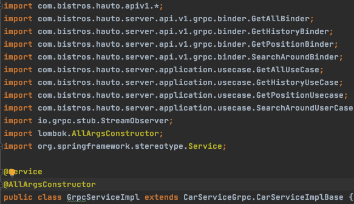
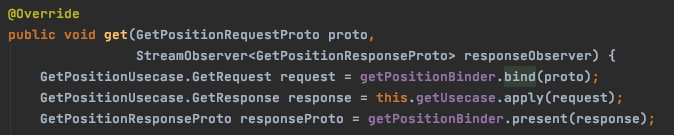
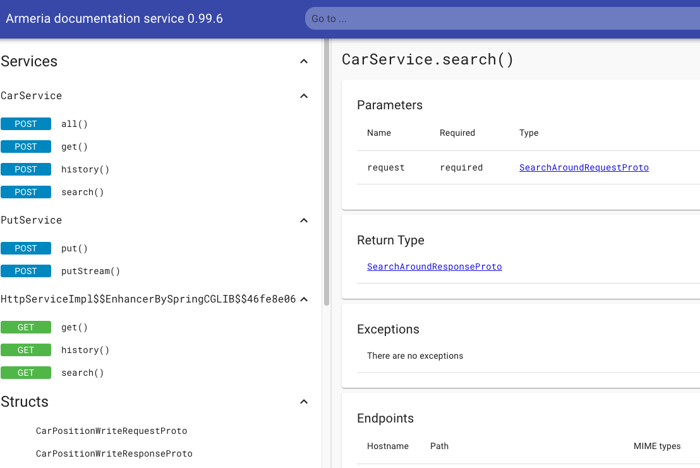

## Server
### 개요
* 4개의 API를 제공하는 Gateway 형태의 서비스라는 전통적인 MVC 으로도 충분하다. 하지만 좀 더 모던한 프로젝트를 구성하기 위해
 그리고 추후에 있을 Http Protocol 지원 그리고 계속되는 API 추가로 있해 '슈퍼 Service Class'가 생기는걸 방지 하기 위한 목적으로
 클린 아키텍쳐를 적용하기로 하였다. https://blog.cleancoder.com/uncle-bob/2012/08/13/the-clean-architecture.html
   
----

### Data Flow
* 순서
  1. Grpc요청에서 순수한 Java Request Model을 만든다.
  2. Java Request Model 로 각 니즈에 맞는 UseCase를 수행한다.
  3. UseCase의 결과를 순수한 Java Response Model로 만든다.
  4. Grpc or Http 프로토콜에 맞추어 ViewModel 로 만들어 Return 한다

* Grpc/HTTP 의존성은 1,4단계에서만 연결되고 2,3번은 Request - Usecase - Response 외부 요인과 무관하게 처리된다.

#### Server Package
* API Package
  * Http, Grpc에 의존적인 Request 정보를 Pure Java 로 변한하거나
  * Pure Java 응답 데이터를 각 프로토콜에 맞게 View 형태로 전환한다.
  * 즉, 이 API 영역만이 `외부와 접근` 된다. 외부의 API가 바뀌면 로직이 바뀌지 않는 이상 이 Package만 변경하면 된다.
    (즉, 외부의 변경요소가 Application Package 까지 침투하여 로직에 영향을 주지 않는다)
    
    GrpcServiceImpl의 내용이다. 
    grpc -> request -> usecase 처리 -> response model -> grpc response 
   
   
* Application Package
  * UseCase 는 각각의 API 의 실제 비지니스 로직을 구현한다.
  * Request 를 상속한 '작업을 요청한 모델'을 인자로 받아 로직을 처리하고  Response 를 상속한 클래스로 반환 한다
  * 외부 요소와, Infra layer가 변경되지 않는 '로직'의 변경은 Application, Domain Package 에만 영향을 미친다
  
  
* Domain package
  * 이 서버가 비지니스 로직을 수행하기 위해서 필요한 인터페이스와 도메인의 모음 (Rest,Grpc등등은 전혀 침입하면 안되는 영역이다)
* Infra Package
  * 데이터베이스, RESTAPI 등의 구현체와 관련된 서비스, DTO 등이 위치한다.
  * 예를 들어 MSA 로 구축되어 있는 Location 서비스가 Car 서비스를 이용해야 할 경우
    CarService 를 이용하여 CarDto를 받아온다 (내부적으로 CarService는 CarRestTemplate을 쓸 것이다)  
    
    그 다음 실제로 우리가 '비지니스 로직'을 처리하는 usecase 에서는 CarDTO 에서 얻은 `Car`만 집중하면 된다.
* Configuration, Operation 
  * 설정과 운영을 위한 패키지    
    
  

### Framework
* 왜 Aremria 인가? (이하 아르메리아)
  * 예전에 잠깐 Golang을 한 추억으로 결정하기에는 시간도 없고 에코 시스템의 지식도 부족하다. 자바 프레임워크가 필요
  * 예전에 Avro/Thrift를 할 때 실제 데이터 송수신 프로토콜을 사람 눈으로 보지 못해 운영에 애를 먹은 적이 있다. '아르메리아'에는 이러한 불편함을 해결하기 위해서
  DocService ( https://line.github.io/armeria/docs/server-docservice ) 와  Http 와 Thrift, Protobuf를 Composite 하여 서빙 할 수 있다고 한다.
  * Boot-Starter가 이미 제공되어서 빠르게 시작 할 수 있었다.
  
* 실제로 써보니?
  * 단일 포트로 Http/Grpc 동시에 서빙하는 것도 good
  * DocService는 훌륭하다 '스웨이거'의 자동화 버전 정도이다. 하지만 Docuemnt 정도일 뿐이지 실제로 curl처럼 호출해볼수는 없다.
  * 아래 첨부 이미지는 실제 DocService 화면 중 'search' API 내용이다.
  

* Http 와 Protobuf 를 Composite 할 수 있지만, 
  Http 쪽은 스프링의 지식을 그대로 사용할 수는 없고 약간의 학습 비용이 더 들어보인다.
  
  그리고 설정을 바꿀 수 없는 것들도 몇개 겪었다.
  예를 들면 ObjectMapper 는 Http Service 에 Injection 가능하지만, 그 외에 영역에는 사용자가 커스텀 할 수 있는 영역이 작아보인다.
  
   
       
 

----

### API 

#### SEARCH
#### HISTORY
* API에 검색이 있기에 이 것에 대한 고민만 하다가 ... 고민만 하게 되었다. (차라리 처음부터 신경 껏더라면 좀 더 다른걸 할 수 있었을 텐데)
* 앞에서 정의한 것 처럼 0.00001 은 약 1m 이다. ( 1.0 = 100km ) 가로 세로 1km 인 Region 으로 정의한다면
  위도 37 ~ 38 , 경도 127 ~ 128 구간에서는 100 * 100 인 1만개의 Region 이 생긴다.
  대한민국의 경우 위도 33-43, 경도 124-132 이므로 Region 은 최대 1만 * 10*8 = 80만개가 생성이 된다.
  
  이것을 Index Key로 잡더라도 크게 무리가 될 수준은 아닌것 같다. 
  그리고 1km * 1km 안에 차량으로 가득차 있다고 가정 할 경우 (차의 크기는 2m * 2m라고 하자) 25만대 수준이다.
  
  거리를 계산하는 코사인 계산방법이 연산 비용이 들지만 25만대 각각 독립 수행이 가능하기 때문에, 큰 문제는 되어보이지 않는다.
  
  더 중요한건, 이렇게 100km 단위로 search를 않을 것 같고,  
  근거리 search는 lat,lon 중심 좌표를 기준으로 잘게 나눈 블럭의 9개 ,16개,25개 순으로 검새하는게 좋지 않을까 생각함
  
  하지만.. 생각만 하다 구현은 못하고 for-loop로 돌림 :(    

#### GET
* HTTP Protocol 에서는 NOT_FOUND Status , empty entity 를 반환하는 형태로 처리했다. 
  하지만 Protobuf syntax3 에서는 response 에 'has' filed pattern 을 이용하거나 Exception 을 잡아서 처리하는 방법등이 있는 것 같다.
  
  이 부분에 대한 고민이 좀 더 필요로 하다.
    
   
#### PUT
* 자동차는 네트워크의 단절을 항상 염두해 둬야한다. 그렇기 떄문에 '이벤트 생성'시간이 '서버에 저장된 시간'가 일치하지도 않고 그 Gap 은 몇 일이 될 수도 있다.
  그렇기 때문에 event-time은 Client 에서 생성하고, receive-time은 Server 에서 생성해서 추후에 시간 정렬 작업이 가능하도록 해야한다.
   
  `rpc put(stream data) returnes status` 형태로 stream 으로 전송 할 수 있지만, 대량의 네트워크 전송이 아닌 위치 정보에서 이것이 과연 필요로 할 까?
  그리고 네트워크가 수시로 단절/복구 된다고 할 때에도 유리할까? 라는 고민이 든다 
