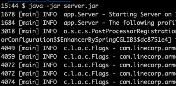
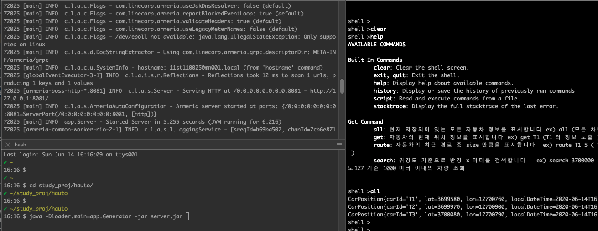
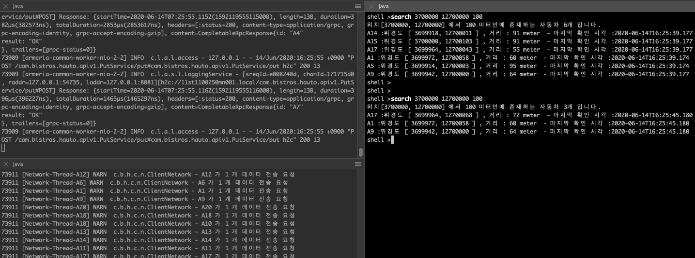

# 실행 방법

### 1. Server
* 기본 실행방법
   ```
   java -jar server.jar 
   ```
   이런 로그가 출력되면서 서버가 시작됩니다. 기본 포트는 `8081` 입니다.

   
* T1, T2, T3 ID를 가지는 차량 3대의 테스트 정보가 기본 적재됩니다. 데이터 데이터가 필요 없다면 --skipdata 옵션을 추가하세요.
    ```
    java -jar server.jar  --skipdata
    
    output
    [main] ERROR c.b.h.s.o.t.LoadTestDataRunner - 테스트 데이터를 올리지 않고 Server Application 을 실행합니다
    ```
  

### 2. Tester (CommandLine 에서 API 테스트)
```
java -jar tester.jar
```

### 3. Generator (추가적인 데이터 생성기) 
* 기본 실행
```
java -Dloader.main=app.Generator -jar server.jar
```

* 데이터 생성량을 변경하고 싶다면 다음과 같이 옵션을 추가할 수 있습니다.
  * -Dapp.client.size=3 :  시물레이터를 3개 생성합니다
  * -Dapp.client.time=2 : 각 시물레이터가 2초 주기로 위치 정보를 업데이트 합니다
  * 예시) 3개의 자동차 시물레이터가 2초마다 데이터를 생성합니다.
    ```
    java -Dloader.main=app.Generator -Dapp.client.size=10 -Dapp.client.time=2 -jar build/libs/hauto-1.0.0-SNAPSHOT.jar
    ``` 
### 4. 실행 화면
* 좌측 상단 : 서버 실행 화면 
* 좌측 하단 : Generator 실행 준비 중인 화면
* 우측 : Tester 실행 화면하여 'all' 을 통해 테스트 데이터를 확인 한 화면
  

* 이 후 Generator 를 실행하고 위도37. 경도127 기준으로 검색을 한 화면
